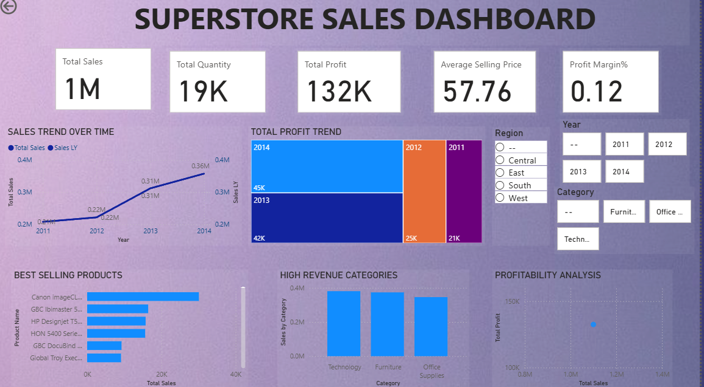

# 🛒 Superstore Sales Dashboard

A visually interactive *Power BI dashboard* created to analyze and track the *sales performance of the Superstore dataset*.  
This project helps understand key business insights like profit trends, sales distribution, and customer behavior.

---

## 📊 Project Overview

This dashboard provides a clear overview of:
- 🧾 Total Sales, Profit & Quantity Sold  
- 🌎 Sales by Region and State  
- 🕐 Year-over-Year Sales Trends  
- 📦 Category and Sub-Category Performance  
- 👥 Top Customers and Payment Mode Analysis  

---

## 🖼️ Dashboard Preview

---

## 🧠 Tools & Skills Used

| Tool | Purpose |
|------|----------|
| *Power BI* | Data Visualization |
| *Excel / CSV* | Data Cleaning & Preparation |
| *DAX Measures* | Calculations and KPIs |
| *Data Modeling* | Relationship Building |

---

## 📈 Key Insights

- *Highest Sales:* Technology category  
- *Least Profitable:* Furniture segment  
- *Most Profitable Region:* West  
- *Top Contributing States:* California & New York  

---

## 🧩 Future Enhancements

- Add forecasting visuals for upcoming sales  
- Include discount & profit margin comparison  
- Integrate live data from SQL  

---

## 👩‍💻 About the Creator

*Name:* Tanya Maggo  
*Email:* [tanyamaggo26@gmail.com](mailto:tanyamaggo26@gmail.com)  
*LinkedIn:* Tanya Maggo(https://www.linkedin.com/in/tanya-maggo-8a354b315?utm_source=share&utm_campaign=share_via&utm_content=profile&utm_medium=ios_app)
If you liked this dashboard, ⭐ star this repository on GitHub!

---

### 💡 How to View the Dashboard

1. Download the .pbix file from this repo.  
2. Open it using *Power BI Desktop*.  
3. Explore the visuals and filters interactively.

---

> “Turning raw data into meaningful stories with Power BI.”
